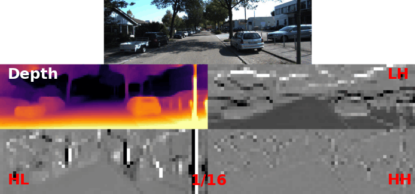
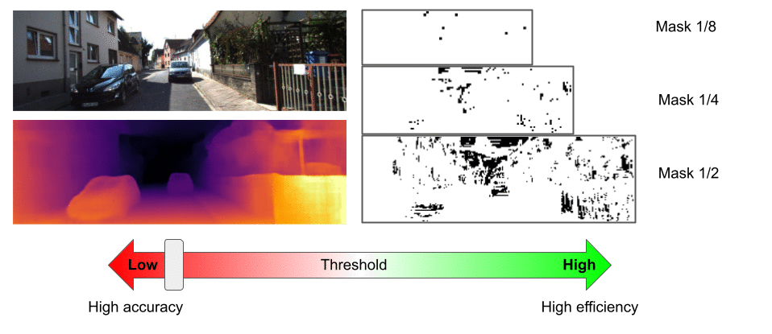
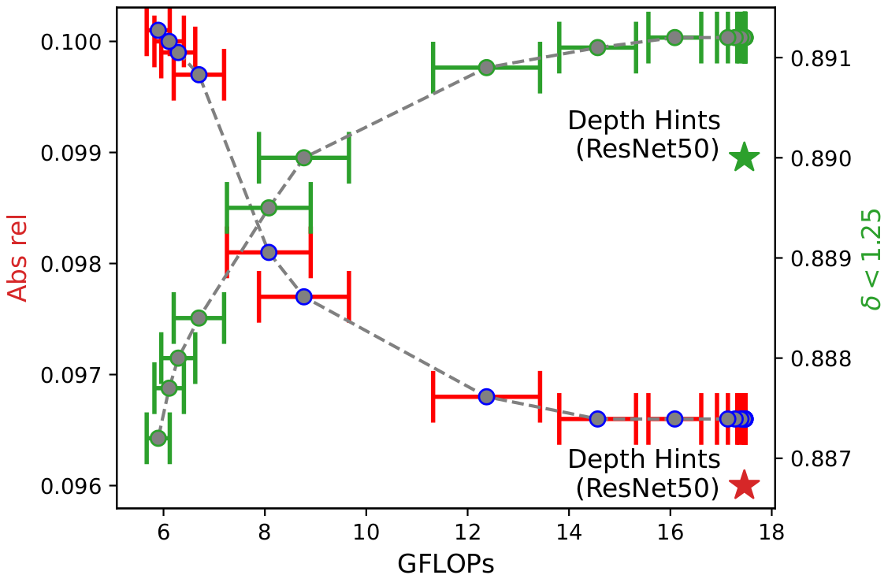

# WaveletMonoDepth experiments on KITTI 

<p align="center">

</p>

[Depth Hints](https://github.com/nianticlabs/depth-hints) was used as a baseline for KITTI.

***Depth Hints*** builds upon [monodepth2](https://github.com/nianticlabs/monodepth2). If you have questions about running the code, please see the issues in their repositories first.

## 💾 Download / generate dataset 
Please follow the instructions in [monodepth2](https://github.com/nianticlabs/monodepth2) to download and set up the 
KITTI dataset. We used *jpeg* format images for training.
To precompute Depth Hints using Semi Global Matching, run:

``` python precompute_depth_hints.py --data_path <your_KITTI_path>```

You can optionally set ```--save_path``` (default <data_path>/depth_hints) and ```--filenames``` (will default to 
training and validation images for the Eigen split). As indicated in 
[Depth Hints](https://github.com/nianticlabs/depth-hints), this process takes approximately 4 hours on a GPU, and 
requires ~140Gb storage space.

## 📉 Training

In order to train our WaveletMonoDepth method on KITTI with a 1024x320 resolution (using the dense convolutions first), 
run the following: 

```
python train.py \
  --data_path <your_KITTI_path> \
  --log_dir <your_save_path> \
  --encoder_type resnet --num_layers 50 \
  --width 1024 --height 320 \
  --model_name wavelet_S_HR_DH \
  --use_depth_hints \
  --depth_hint_path <your_depth_hint_path> \
  --frame_ids 0  --use_stereo \
  --split eigen_full \
  --use_wavelets
```

**Note that the above command uses depth hints**, so make sure you have generated depth hints before running it. If you 
want to train our method without depth hints, simply remove `--use_depth_hints` and `--depth_hint_path`.

## 📋 Evaluation

```
python evaluate_depth.py \
  --data_path <your_KITTI_path>  
  --encoder_type resnet --num_layers 50 \
  --width 1024 --height 320 \
  --load_weights_folder <path_to_model>
  --use_wavelets
  --eval_stereo
  --eval_split eigen
  --post_process
```

In the above command, `<path_to_model>` is `<your_save_path/model_name/weights_19` using the notations in the training 
section, and assuming you trained your network using the command in the Training section. 
In any case, `<path_to_model>` must contain the `depth.pth` weights file.

**Note: before running the above command, make sure you have prepared ground truth data. You should have the file 
`gt_depths.npz` saved in `splits/eigen/`. If not, run:** 

```python export_gt_depth.py --data_path <your_KITTI_path> --split eigen```

## 📊 Results and 📦 Trained models

Check our paper to find detailed results in different settings using **dense** convolutions to predict wavelet 
coefficients. You can also download the associated trained models and their predictions. Download links coming soon!

| Model name | Training modality | Resolution | abs_rel | RMSE | δ<1.25 |
| ---------- | ---------- | ---------- | ----- | ------ | ----- |
| [`Ours Resnet18`](https://drive.google.com/file/d/1uDJoikUBiDZZOLDMDNsn_eAXByL5g9mi/view?usp=sharing) | Stereo + DepthHints | 640 x 192 | 0.106 | 4.693 | 0.876 |
| [`Ours Resnet50`](https://drive.google.com/file/d/1UykLnyAlWjqVYWQ5wGK2I1uonYvdJ-2F/view?usp=sharing) | Stereo + DepthHints | 640 x 192 | 0.105 | 4.625 | 0.879 |
| [`Ours Resnet18`](https://drive.google.com/file/d/1wyXNOgaboQI1s2EwJIuE2APWPVLJwKWM/view?usp=sharing) | Stereo + DepthHints | 1024 x 320 | 0.102 | 4.452 | 0.890 |
| [`Ours Resnet50`](https://drive.google.com/file/d/1fVkPEv71b-3RBr_n52WPcj3wd-UKVrkF/view?usp=sharing) | Stereo + DepthHints | 1024 x 320 | 0.097 | 4.387 | 0.891 |

## 🎚 Playing with sparsity

However, the most interesting part is how we can effectively use the sparse property of said wavelet coefficients to 
trade-off performance with efficiency, at a minimal cost in performance.

The following graph shows relative performance decrease when tuning the wavelet threshold. Computing coefficients at only 10% of the pixels in the decoding process gives a relative score loss of less than 1.4%.

<p align="center">
  
</p>

<p align="center">
  
</p>

Our wavelet based methods allows us to greatly reduce the number of computation in the decoder at a minimal expense in 
performance. We can therefore trade off performance for FLOPs reduction as shown below (red is abs_rel, green is δ<1.25).

<p align="center">
  
</p>

## 🎮 Try it yourself!

To try our method and visualize results with different levels of sparsity, as well as compute the resulting 
computational saving in FLOPs, use our Jupyter notebook `sparsity_test_notebook.ipynb`.