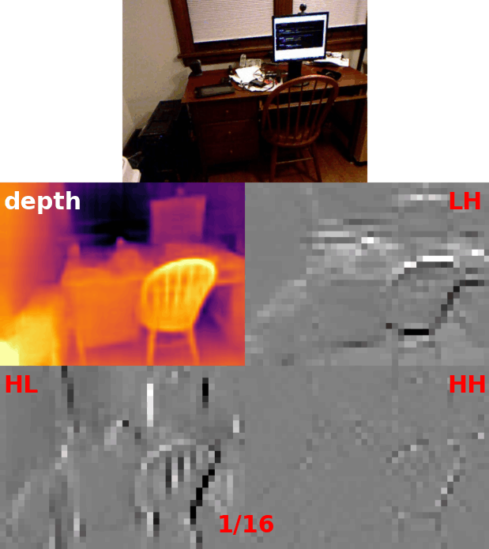
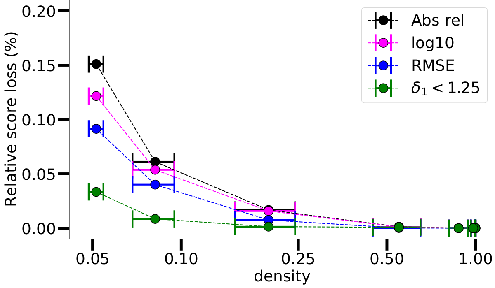
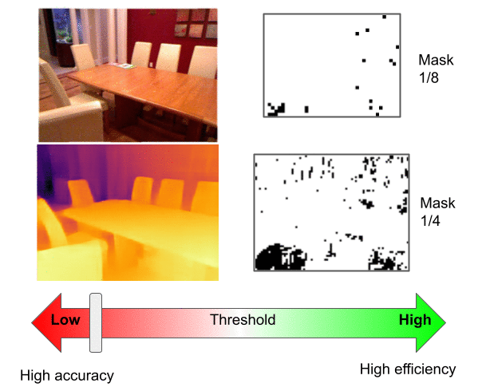

# WaveletMonoDepth experiments on NYUv2

<p align="center">

</p>

[DenseDepth](https://github.com/ialhashim/DenseDepth) was used as a baseline for NYUv2.
Note that we used the experimental PyTorch implementation of DenseDepth. Note that compared to the original paper, we 
made a few different modifications:

- we supervise depth directly instead of supervising disparity
- we do not use SSIM
- we use DenseNet161 as encoder

Please consider looking at the original repository first for questions about the code.

## 💾 Download training data 
Please follow the instructions in [DenseDepth](https://github.com/ialhashim/DenseDepth) to download the pre-processed
NYUv2 dataset. Make sure you have put the `nyu_data.zip` file in the current directory (`NYUv2`). You can also create a 
symbolic link with:

```
ln -s <path_to_downloaded_densedepth_training_nyu_data.zip> 
```

## 📉 Training

In order to train our WaveletMonoDepth method on NYUv2 with a 640x480 resolution (using the dense convolutions first), 
run the following: 

```
python train.py
  --encoder_type densenet \
  --logdir log \
  --model_name WaveletMDP \
  --bs 8 \
  --num_workers 8 \
  --output_scales 0 1 2 3 \  
  --loss_scales 0 1 2 3 \  
  --use_wavelets \
  --normalize_input
```

***Note on Training data format:*** [DenseDepth](https://github.com/ialhashim/DenseDepth) provides training data stored stored as 8bits PNGs. They chose to quantize depth maps between 0.7m and 10m with 8bits. Therefore, in order to get metric depth from their data, one should first divide by 255 then multiply by 10. 
Note that data from the original labeled NYUv2 dataset (see below) is stored in (float) meters.

## 📋 Evaluation

### Downloading evaluation depth data
Download the labeled NYUv2 data:
```
wget http://horatio.cs.nyu.edu/mit/silberman/nyu_depth_v2/nyu_depth_v2_labeled.mat
```

Download the Eigen splits:
```
wget http://horatio.cs.nyu.edu/mit/silberman/indoor_seg_sup/splits.mat -O nyuv2_splits.mat
```

### Downloading [NYUv2-OC++](https://michaelramamonjisoa.github.io/projects/DisplacementFields)

To evaluate depth edges quality, download and unzip the manually annotated NYUv2-OC++ test dataset from its 
[project page](https://michaelramamonjisoa.github.io/projects/DisplacementFields). You should now have a `NYUv2_OCpp` 
folder in the current directory. 

✏️📄 *Make sure you cite the original papers 
([1](https://michaelramamonjisoa.github.io/projects/SharpNet),
[2](https://michaelramamonjisoa.github.io/projects/DisplacementFields)) 
if you also use this dataset for evaluation* 📄✏️:

``` 
@article{ramamonjisoa2019sharpnet, 
 Title = {SharpNet: Fast and Accurate Recovery of Occluding Contours in Monocular Depth Estimation}, 
 Author = {M. Ramamonjisoa and V. Lepetit}, 
 Journal = {The IEEE International Conference on Computer Vision (ICCV) Workshops}, 
 Year = {2019}
 } 
 
@InProceedings{Ramamonjisoa_2020_CVPR, 
 author = {Ramamonjisoa, Michael and Du, Yuming and Lepetit, Vincent}, 
 title = {Predicting Sharp and Accurate Occlusion Boundaries in Monocular Depth Estimation Using Displacement Fields}, 
 booktitle = {IEEE/CVF Conference on Computer Vision and Pattern Recognition (CVPR)},
 month = {June},
 year = {2020}
 }
```

### Evaluate!

```
python evaluate.py \
  --normalize_input \
  --encoder_type densenet \
  --load_weights_folder <path_to_model> \  
  --use_wavelets
  --eval_edges
```

In the above command, `<path_to_model>` should contain `model.pth`. If you do not need to evaluate depth edges quality, 
simply remove the `--eval_edges` flag.

### 📊 Results and 📦 Trained models

Please find below the scores using **dense** convolutions to predict wavelet coefficients. 
Download links coming soon!

| Model name | Encoder | Resolution | abs_rel | RMSE | δ<1.25 | ε_acc |
| ---------- | ---------- | ---------- | ---------- | ----- | ----- | ----- |
| [`Baseline`](https://drive.google.com/file/d/1WmGBXBwbR8jh8H_F7TK2LuUNJ1T_wfcQ/view?usp=sharing) | DenseNet | 640 x 480 | 0.1277 | 0.5479 | 0.8430 | 1.7170 |
| [`Ours`](https://drive.google.com/file/d/1LubjqXEzAd2SI6Zwse6VFvHoobTr4P8Z/view?usp=sharing) | DenseNet | 640 x 480 | 0.1258 | 0.5515 | 0.8451 | 1.8070 |
| [`Baseline`](https://drive.google.com/file/d/18BU-4u_9NWm67NCLk1On5IA0lJor6DHY/view?usp=sharing) | MobileNetv2 | 640 x 480 | 0.1772 | 0.6638 | 0.7419 | 1.8911 |
| [`Ours`](https://drive.google.com/file/d/1-dcOO0T_YlFATwZBTg5ejg5evtR319Zi/view?usp=sharing) | MobileNetv2 | 640 x 480 | 0.1727 | 0.6776 | 0.7380 | 1.9732 |

### 🎚 Playing with sparsity

As with the KITTI dataset, we can tune the wavelet threshold to greatly reduce computation at minimal cost on 
performance.

Computing coefficients at only 5% of the pixels in the decoding process gives a relative depth score loss of less than 
0.15%. 

<p align="center">
  
</p>

<p align="center">
  
</p>

## 🎮 Try it yourself!

To try our method and visualize results with different levels of sparsity, as well as compute the resulting 
computational saving in FLOPs, use our Jupyter notebook `sparsity_test_notebook.ipynb`.
