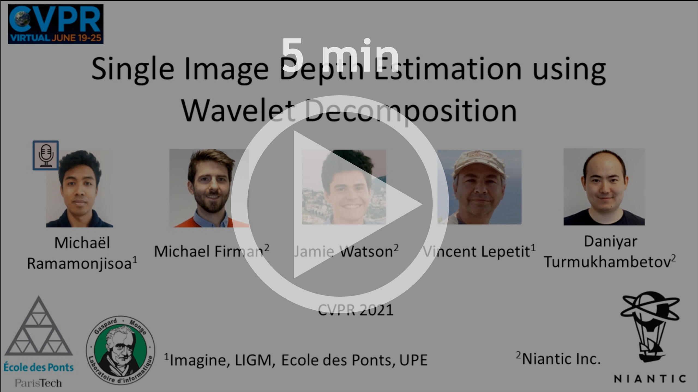
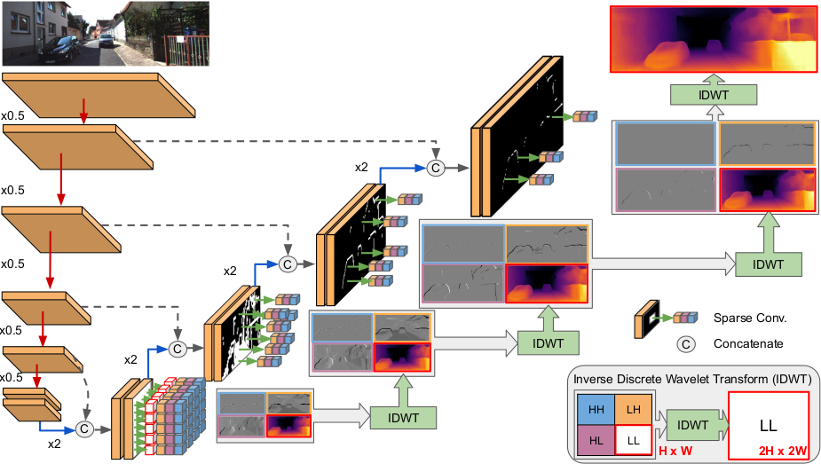

# Single Image Depth Prediction with Wavelet Decomposition


**[Michaël Ramamonjisoa](https://michaelramamonjisoa.github.io), 
[Michael Firman](http://www.michaelfirman.co.uk), 
[Jamie Watson](https://scholar.google.com/citations?view_op=list_works&hl=en&user=5pC7fw8AAAAJ), 
[Vincent Lepetit](http://imagine.enpc.fr/~lepetitv/) and 
[Daniyar Turmukhambetov](http://dantkz.github.io/)**

***CVPR 2021***

[[Link to paper]](http://arxiv.org/abs/2106.02022)

<p align="center">
  
  
</p>

**We introduce *WaveletMonoDepth*, which improves efficiency of standard encoder-decoder monocular depth estimation methods
by exploiting wavelet decomposition.**


<p align="center">
  <a
href="https://storage.googleapis.com/niantic-lon-static/research/wavelet-monodepth/5min.mp4">
  
  </a>
</p>


## 🧑‍🏫 Methodology 

**WaveletMonoDepth** was implemented for two benchmarks, KITTI and NYUv2. For each dataset, we build our code upon 
a baseline code. Both baselines share a common encoder-decoder architecture, and we modify their decoder to provide a 
wavelet prediction.

Wavelets predictions are sparse, and can therefore be computed only at relevant locations, therefore saving a lot of 
unnecessary computations.

<p align="center">
  
</p>

The network is first trained with a **dense** convolutions in the decoder until convergence, and the dense convolutions 
are then replaced with **sparse** ones. 

This is because the network first needs to learn to predict sparse wavelet coefficients before we can use sparse convolutions.

## 🗂 Environment Requirements 🗂 ##

We recommend creating a new Anaconda environment to use WaveletMonoDepth. Use the following to setup a new environment:

```
conda env create -f environment.yml
conda activate wavelet-mdp
```

Our work uses [Pytorch Wavelets](https://github.com/fbcotter/pytorch_wavelets), a great package from Fergal Cotter 
which implements the Inverse Discrete Wavelet Transform (IDWT) used in our work, and a lot more! 
To install Pytorch Wavelets, simply run:
```
git clone https://github.com/fbcotter/pytorch_wavelets
cd pytorch_wavelets
pip install .
```

## 🚗🚦 KITTI 🌳🛣  
[Depth Hints](https://github.com/nianticlabs/depth-hints) was used as a baseline for KITTI.

***Depth Hints*** builds upon [monodepth2](https://github.com/nianticlabs/monodepth2). If you have questions about running the code, please see the issues in their repositories first.

### ⚙ Setup, Training and Evaluation 
Please see the [KITTI](./KITTI/README.md) directory of this repository for details on how to train and evaluate our method. 

### 📊 Results 📦 Trained models

Please find below the scores using **dense** convolutions to predict wavelet coefficients. Download links coming soon!

| Model name | Training modality | Resolution | abs_rel | RMSE | δ<1.25 |Weights | Eigen Predictions | 
| ---------- | ---------- | ---------- | ----- | ------ | ----- | ---------- | ------- |
| `Ours Resnet18` | Stereo + DepthHints | 640 x 192 | 0.106 | 4.693 | 0.876 | *Coming soon* | *Coming soon* |
| `Ours Resnet50` | Stereo + DepthHints | 640 x 192 | 0.105 | 4.625 | 0.879 | *Coming soon* | *Coming soon* |
| `Ours Resnet18` | Stereo + DepthHints | 1024 x 320 | 0.102 | 4.452 | 0.890 | *Coming soon* | *Coming soon* |
| `Ours Resnet50` | Stereo + DepthHints | 1024 x 320 | 0.097 | 4.387 | 0.891 | *Coming soon* | *Coming soon* |

### 🎚 Playing with sparsity

However the most interesting part is that we can make use of the sparsity property of the predicted wavelet coefficients
to trade-off performance with efficiency, at a minimal cost on performance. We do so by tuning the threshold, and:
- low thresholds values will lead to high performance but high number of computations,
- high thresholds will lead to highly efficient computation, as convolutions will be computed only in a few pixel locations. This will have a minimal impact on performance.

<p align="center">
  
</p>

Computing coefficients at only 10% of the pixels in the decoding process gives a relative score loss of less than 1.4%.

<p align="center">
  
</p>

Our wavelet based method allows us to greatly reduce the number of computation in the decoder at a minimal expense in 
performance. We can measure the performance-vs-efficiency trade-off by evaluating scores vs FLOPs.

<p align="center">
  
</p>

## 🪑🛁 NYUv2 🛋🚪
[Dense Depth](https://github.com/ialhashim/DenseDepth) was used as a baseline for NYUv2.
Note that we used the experimental PyTorch implementation of DenseDepth. Note that compared to the original paper, we 
made a few different modifications:

- we supervise depth directly instead of supervising disparity
- we do not use SSIM
- we use DenseNet161 as encoder instead of DenseNet169

### ⚙ Setup, Training and Evaluation 
Please see the [NYUv2](./NYUv2/README.md) directory of this repository for details on how to train and evaluate our method.

### 📊 Results and 📦 Trained models

Please find below the scores and associated trained models, using **dense** convolutions to predict wavelet 
coefficients.


| Model name | Encoder | Resolution | abs_rel | RMSE | δ<1.25 | ε_acc | Weights | Eigen Predictions |
| ---------- | ---------- | ---------- | ---------- | ----- | ----- | ----- | ----- | ------ |
| `Baseline` | DenseNet | 640 x 480 | 0.1277 | 0.5479 | 0.8430 | 1.7170 | *Coming soon* | *Coming soon* | 
| `Ours` | DenseNet | 640 x 480 | 0.1258 | 0.5515 | 0.8451 | 1.8070 | *Coming soon* | *Coming soon* |
| `Baseline` | MobileNetv2 | 640 x 480 | 0.1772 | 0.6638 | 0.7419 | 1.8911 | *Coming soon* | *Coming soon* | 
| `Ours` | MobileNetv2 | 640 x 480 | 0.1727 | 0.6776 | 0.7380 | 1.9732 | *Coming soon* | *Coming soon* |

### 🎚 Playing with sparsity

As with the KITTI dataset, we can tune the wavelet threshold to greatly reduce computation at minimal cost on 
performance.

<p align="center">
  
</p>

Computing coefficients at only 5% of the pixels in the decoding process gives a relative depth score loss of less than 
0.15%. 

<p align="center">
  
</p>

## 🎮 Try it yourself!

Try using our Jupyter notebooks to visualize results with different levels of sparsity, as well as compute the 
resulting computational saving in FLOPs. Notebooks can be found in `<DATASET>/sparsity_test_notebook.ipynb` where 
`<DATASET>` is either KITTI or NYUv2. 

## ✏️ 📄 Citation

If you find our work useful or interesting, please consider citing [our paper](http://arxiv.org/abs/2106.02022/):

```
@inproceedings{ramamonjisoa-2021-wavelet-monodepth,
  title     = {Single Image Depth Prediction with Wavelet Decomposition},
  author    = {Ramamonjisoa, Micha{\"{e}}l and
               Michael Firman and
               Jamie Watson and
               Vincent Lepetit and
               Daniyar Turmukhambetov},
  booktitle = {Proceedings of the IEEE/CVF Conference on Computer Vision and Pattern Recognition},
  month = {June},
  year = {2021}
}
```


## 👩‍⚖️ License
Copyright © Niantic, Inc. 2021. Patent Pending.
All rights reserved.
Please see the [license file](LICENSE) for terms.
